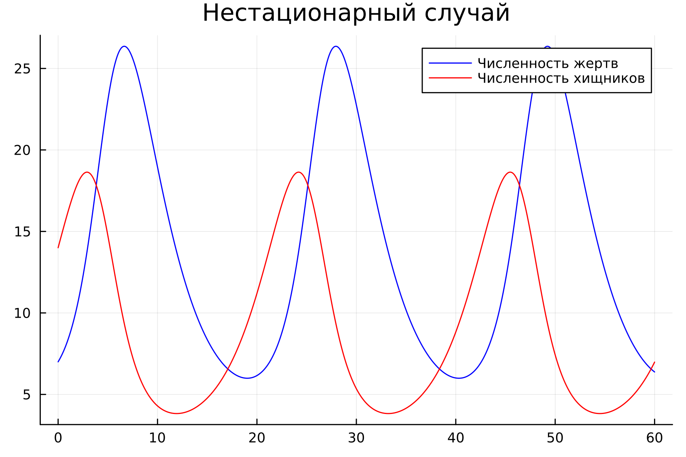
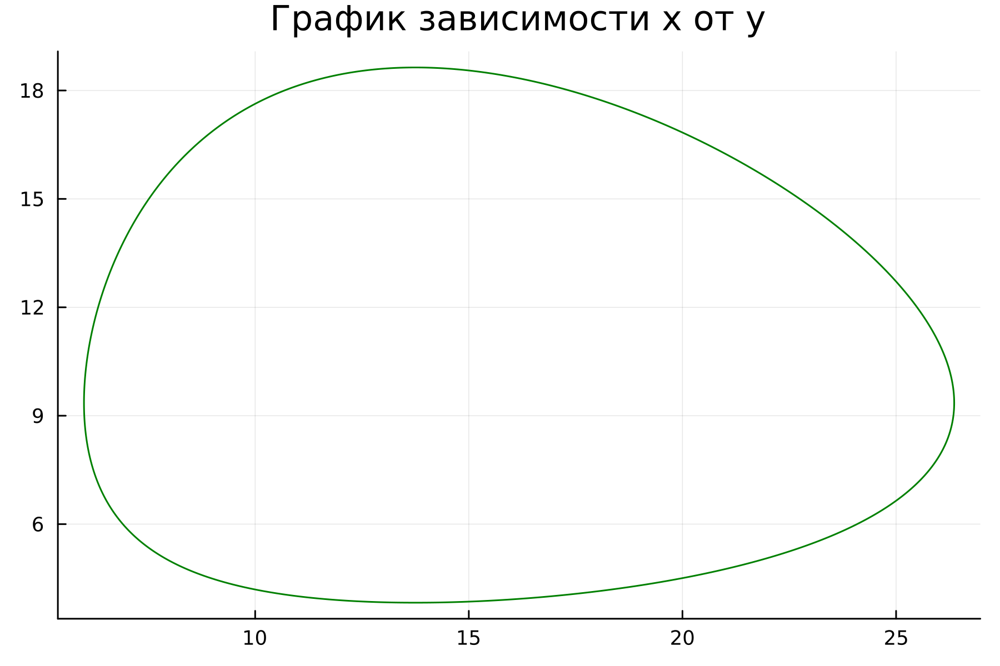
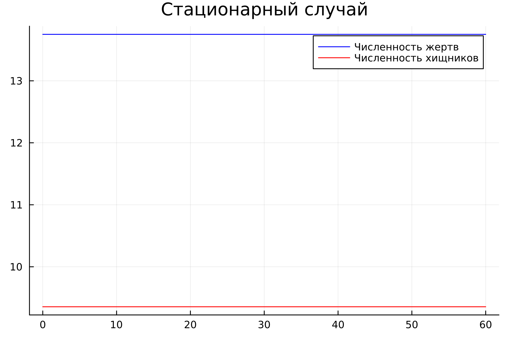
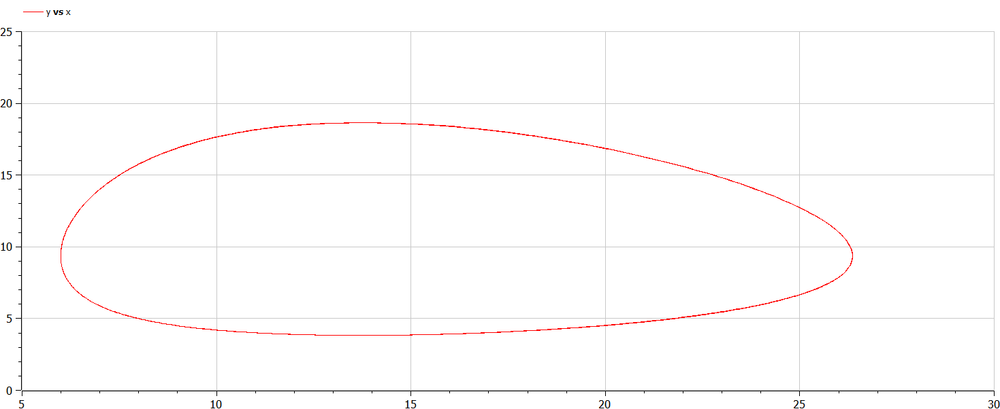
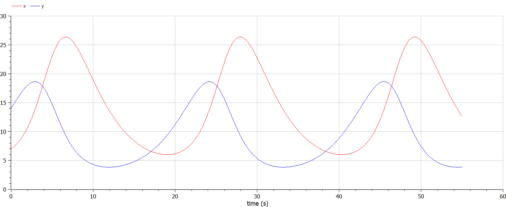

---
## Front matter
title: "Отчет по лабораторной работе №5"
subtitle: "Модель хищник-жертва"
author: "Бекбузарова Роза Алисхановна"


## Pdf output format
toc: true # Table of contents
toc-depth: 2
lof: true # List of figures
lot: true # List of tables
fontsize: 12pt
linestretch: 1.5
papersize: a4
documentclass: scrreprt
## I18n polyglossia
polyglossia-lang:
  name: russian
  options:
	- spelling=modern
	- babelshorthands=true
polyglossia-otherlangs:
  name: english
## I18n babel
babel-lang: russian
babel-otherlangs: english
## Fonts
mainfont: PT Serif
romanfont: PT Serif
sansfont: PT Sans
monofont: PT Mono
mainfontoptions: Ligatures=TeX
romanfontoptions: Ligatures=TeX
sansfontoptions: Ligatures=TeX,Scale=MatchLowercase
monofontoptions: Scale=MatchLowercase,Scale=0.9
## Biblatex
biblatex: true
biblio-style: "gost-numeric"
biblatexoptions:
  - parentracker=true
  - backend=biber
  - hyperref=auto
  - language=auto
  - autolang=other*
  - citestyle=gost-numeric
## Pandoc-crossref LaTeX customization
figureTitle: "Рис."
tableTitle: "Таблица"
listingTitle: "Листинг"
lofTitle: "Список иллюстраций"
lotTitle: "Список таблиц"
lolTitle: "Листинги"
## Misc options
indent: true
header-includes:
  - \usepackage{indentfirst}
  - \usepackage{float} # keep figures where there are in the text
  - \floatplacement{figure}{H} # keep figures where there are in the text
---

# Цель работы

- Изучить простейшую модель взаимодействия двух видов типа «хищник — жертва» - модель Лотки-Вольтерры.

- Построить график зависимости x от y и графики функций

- Найти стационарное состояние системы


# Задание
Для модели «хищник-жертва»:


Построить график зависимости численности хищников от численности жертв, а также графики изменения численности хищников и численности жертв при следующих начальных условиях:  Найти стационарное состояние системы.


# Выполнение лабораторной работы

Мой вариант лабораторной работы: 35. 

Я написала 2 программы для каждого из случаев на языке Julia:

Вот листинг первой программы для нестационарного случая. Проблема заключается аналогично предыдущим лабораторным работам в решении одногодного дифференциального уравнения. Решение этой проблемы и отображается на графике.

```julia
using Plots
using DifferentialEquations

x0 = 7
y0 = 14

a = 0.29
b = 0.031
c = 0.33
d = 0.024

function ode_fn(du, u, p, t)
    x, y = u
    du[1] = -a*u[1] + b * u[1] * u[2]
    du[2] = c * u[2] - d * u[1] * u[2]
end

v0 = [x0, y0]
tspan = (0.0, 60.0)
prob = ODEProblem(ode_fn, v0, tspan)
sol = solve(prob, dtmax=0.05)
X = [u[1] for u in sol.u]
Y = [u[2] for u in sol.u]
T = [t for t in sol.t]

plt1 = plot(dpi=300, legend=false)

plot!(plt1, title="График зависимости x от y")
plot!(plt1, X, Y, color=:green)

savefig(plt1, "lab5_1_1.png")

plt2 = plot(dpi=300, legend=true)

plot!(plt2, title="Нестационарный случай")
plot!(plt2, T, X, label="Численность жертв", color=:blue)

plot!( plt2, T, Y, label="Численность хищников", color=:red)

savefig(plt2, "lab5_1_2.png")
```

Полученный результат:
- Первый график отражает $x(t),y(t)$:





Вот листинг второй программы, который помог нам отыскать стационароное состояние системы: Стационарное состояние системы (положение равновесия, не зависящее от времени решение) достигается в точке: $x0=c/d, y0=a/b$
```julia
using Plots
using DifferentialEquations

a = 0.29
b = 0.031
c = 0.33
d = 0.024

x0 = c / d
y0 = a / b

function ode_fn(du, u, p, t)
    x, y = u
    du[1] = -a*u[1] + b * u[1] * u[2]
    du[2] = c * u[2] - d * u[1] * u[2]
end

v0 = [x0, y0]
tspan = (0.0, 60.0)
prob = ODEProblem(ode_fn, v0, tspan)
sol = solve(prob, dtmax=0.05)
X = [u[1] for u in sol.u]
Y = [u[2] for u in sol.u]
T = [t for t in sol.t]

plt = plot(dpi=300, legend=true)

plot!(plt, title="Cтационарный случай")
plot!(plt, T, X, label="Численность жертв", color=:blue)

plot!( plt, T, Y, label="Численность хищников", color=:red)

savefig(plt, "lab5_2.png")
```
- Второй график отражает зависимость x от y:



Полученный результат:


# Выполнение на Modelica
Затем я написала необходимые программы для каждого из случаев для получения решений на языке Modelica в OpenModelica:

Вот листинг первой программы для нестационарного случая случая:
Полученный результат:
model lab05_2
```
Real a = 0.29;
Real b = 0.031;
Real c = 0.33;
Real d = 0.024;

Real x;
Real y;

initial equation
x = 7;
y =  14;

equation
der(x)= -a*x + b*x*y;
der(y)= c*y - d*x*y;
end lab05_2;
```
- Первый график отражает зависимость $x(t), y(t)$:

```
model lab05_1

Real a = 0.29;
Real b = 0.031;
Real c = 0.33;
Real d = 0.024;

Real x;
Real y;

initial equation
x = c/d;
y = a/b;

equation
der(x)= -a*x + b*x*y;
der(y)= c*x - d*x*y;
end lab05_1;
```
- Второй график отражает зависимость x от y:



# Анализ полученных результатов
В итоге проделанной работы мною были построены все необходимые графики: график зависимости численности хищников от численности жертв, графики изменения численности хищников и численности жертв на языках Julia и OpenModelica. Аналогично предыдущим лабораторным работам, код для построения модели хищник-жертва на языке Modelica занимает меньше строк, нежели аналогичное построение на Julia.

Также немаловажно, что на обоих языках содержание графиков получилось идентичным:


  


   

# Выводы
В ходе и по результатам выполнения лабораторной работы я построила необходимые графики (два описывающие нестационарный случай и зависимость количества жертв от количества хищников, и описывающий стационарный случай) на двух языках: Julia и Modelica.

# Список литературы. Библиография {.unnumbered}
[1] Документация по Julia: https://docs.julialang.org/en/v1/

[2] Документация по OpenModelica: https://openmodelica.org/

[3] Модель Лотки – Вольтерры https://ru.wikipedia.org/wiki/%D0%9C%D0%BE%D0%B4%D0%B5%D0%BB%D1%8C_%D0%9B%D0%BE%D1%82%D0%BA%D0%B8_%E2%80%94_%D0%92%D0%BE%D0%BB%D1%8C%D1%82%D0%B5%D1%80%D1%80%D1%8B

[4] Материалы к лабораторной работе


::: {#refs}
:::
