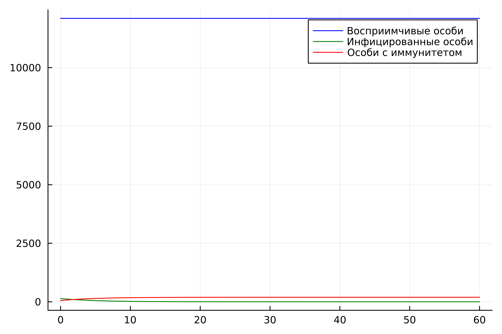
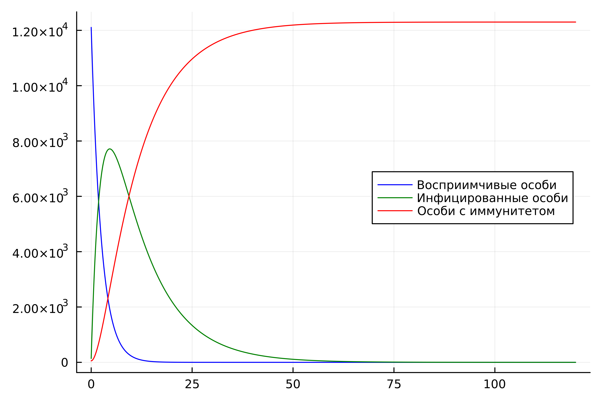
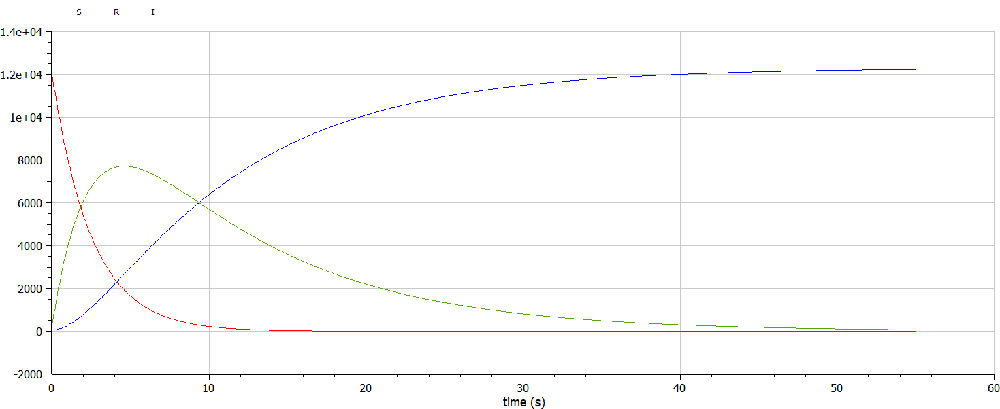
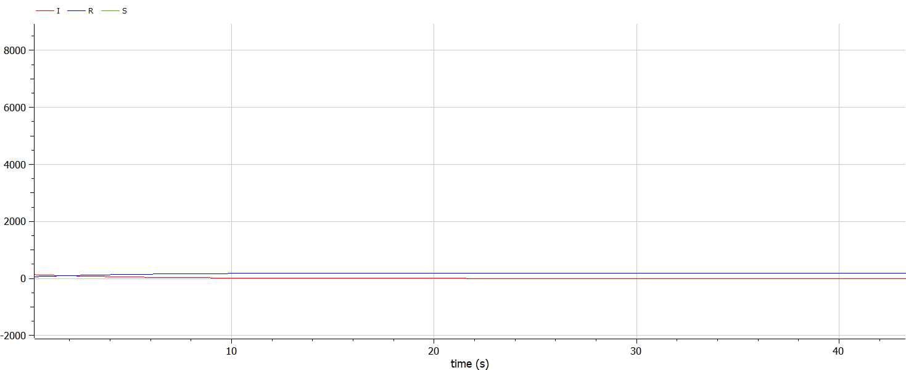

---
## Front matter
title: "Отчёт по лабораторной работе 6"
subtitle: "Задача об эпидемии"
author: "Бекбузарова Роза Алисхановна"

## Generic otions
lang: ru-RU
toc-title: "Содержание"

## Bibliography
bibliography: bib/cite.bib
csl: pandoc/csl/gost-r-7-0-5-2008-numeric.csl

## Pdf output format
toc: true # Table of contents
toc-depth: 2
lof: true # List of figures
lot: true # List of tables
fontsize: 12pt
linestretch: 1.5
papersize: a4
documentclass: scrreprt
## I18n polyglossia
polyglossia-lang:
  name: russian
  options:
	- spelling=modern
	- babelshorthands=true
polyglossia-otherlangs:
  name: english
## I18n babel
babel-lang: russian
babel-otherlangs: english
## Fonts
mainfont: PT Serif
romanfont: PT Serif
sansfont: PT Sans
monofont: PT Mono
mainfontoptions: Ligatures=TeX
romanfontoptions: Ligatures=TeX
sansfontoptions: Ligatures=TeX,Scale=MatchLowercase
monofontoptions: Scale=MatchLowercase,Scale=0.9
## Biblatex
biblatex: true
biblio-style: "gost-numeric"
biblatexoptions:
  - parentracker=true
  - backend=biber
  - hyperref=auto
  - language=auto
  - autolang=other*
  - citestyle=gost-numeric
## Pandoc-crossref LaTeX customization
figureTitle: "Рис."
tableTitle: "Таблица"
listingTitle: "Листинг"
lofTitle: "Список иллюстраций"
lotTitle: "Список таблиц"
lolTitle: "Листинги"
## Misc options
indent: true
header-includes:
  - \usepackage{indentfirst}
  - \usepackage{float} # keep figures where there are in the text
  - \floatplacement{figure}{H} # keep figures where there are in the text
---

# Цель работы

Цель:

Рассмотреть простейшую модель эпидемии, 
построить ее для двух случаев на языках Julia и Modelica.

# Задание

## Вариант 35

На одном острове вспыхнула эпидемия. Известно, что из всех проживающих 
на острове $(N=12300)$ в момент начала эпидемии $(t=0)$ число заболевших людей 
(являющихся распространителями инфекции) $I(0)=140$, А число здоровых людей с 
иммунитетом к болезни $R(0)=54$. Таким образом, число людей восприимчивых к 
болезни, но пока здоровых, в начальный момент времени $S(0)=N-I(0)- R(0)$.

Построить графики изменения числа особей в каждой из трех групп. 
Рассмотреть, как будет протекать эпидемия в случае: 

1. если $I(0) <= I*$
2. если $I(0) > I*$

# Теоретическое введение

## Справка о языках программирования 

Julia – высокоуровневый язык, который разработан для научного программирования. Язык поддерживает широкий функционал для математических вычислений и работы с 
большими массивами данных[1]. 

OpenModelica — свободное открытое программное обеспечение для моделирования, симуляции, оптимизации и анализа сложных динамических систем. 
Основано на языке Modelica. Активно развивается Open Source Modelica Consortium, некоммерческой неправительственной организацией. Open Source Modelica 
Consortium является совместным проектом RISE SICS East AB и Линчёпингского университета. По своим возможностям приближается к таким вычислительным средам как 
Matlab Simulink, Scilab xCos, имея при этом значительно более удобное представление системы уравнений исследуемого блока [2].

## Задача об эпидемии 

Рассмотрим простейшую модель эпидемии. Предположим, что некая 
популяция, состоящая из $N$ особей, (считаем, что популяция изолирована) 
подразделяется на три группы. Первая группа - это восприимчивые к болезни, но 
пока здоровые особи, обозначим их через $S(t)$. Вторая группа – это число 
инфицированных особей, которые также при этом являются распространителями 
инфекции, обозначим их $I(t)$. А третья группа, обозначающаяся через $R(t)$ – это 
здоровые особи с иммунитетом к болезни[3,4].

До того, как число заболевших не превышает критического значения 
I*, считаем, что все больные изолированы и не заражают здоровых. Когда $I(t) > I*$, 
тогда инфицирование способны заражать восприимчивых к болезни особей.

Таким образом, скорость изменения числа $S(t)$ меняется по следующему 
закону:

$$ \frac{dS}{dt} = 
    \begin{cases}
        -\alpha S &\text{,если $I(t) > I^*$}
        \\
        0 &\text{,если $I(t) \leq I^*$}
    \end{cases}
$$


Поскольку каждая восприимчивая к болезни особь, которая, в конце концов, 
заболевает, сама становится инфекционной, то скорость изменения числа 
инфекционных особей представляет разность за единицу времени между 
заразившимися и теми, кто уже болеет и лечится, т.е.:

$$ \frac{dI}{dt} = 
    \begin{cases}
        -\alpha S - \beta I &\text{,если $I(t) > I^*$}
        \\
         - \beta I &\text{,если $I(t) \leq I^*$}
    \end{cases}
$$

А скорость изменения выздоравливающих особей (при этом приобретающие 
иммунитет к болезни)

$$ \frac{dI}{dt} = \beta I $$

Постоянные пропорциональности $\alpha, \beta$, - это коэффициенты заболеваемости 
и выздоровления соответственно.

Для того, чтобы решения соответствующих уравнений определялось 
однозначно, необходимо задать начальные условия .Считаем, что на начало 
эпидемии в момент времени $t = 0$ нет особей с иммунитетом к болезни $R(0)=0$, а 
число инфицированных и восприимчивых к болезни особей 
$I(0)$ и $S(0)$ соответственно. Для анализа картины протекания эпидемии необходимо 
рассмотреть два случая: $I(0) \leq I^*$ и $I(0) > I^*$
[4]

# Выполнение лабораторной работы

## Выполнение на Julia

Мой вариант лабораторной работы: 35. 
Я написала 2 программы для каждого из случаев на языке Julia:

Вот листинг первой программы для cлучая **$I(0) \leq I^*$**. Проблема заключается аналогично предыдущим лабораторным работам в решении одногодного дифференциального уравнения. Решение этой проблемы и отображается на графике. 

```julia
using Plots
using DifferentialEquations

N = 12300
I0 = 140 # заболевшие особи
R0 = 54 # особи с иммунитетом
S0 = N - I0 - R0 # здоровые, но восприимчивые особи
alpha = 0.6 # коэффициент заболеваемости
beta = 0.2 # коэффициент выздоровления
#I0 <= I*
function ode_fn(du, u, p, t)
    S, I, R = u
    du[1] = 0
    du[2] = -beta*u[2]
    du[3] = beta*I
end

v0 = [S0, I0, R0]
tspan = (0.0, 60.0)
prob = ODEProblem(ode_fn, v0, tspan)
sol = solve(prob, dtmax = 0.05)
S = [u[1] for u in sol.u]
I = [u[2] for u in sol.u]
R = [u[3] for u in sol.u]
T = [t for t in sol.t]
plt = plot(
  dpi = 600,
  legend = :topright)
plot!(
  plt,
  T,
  S,
  label = "Восприимчивые особи",
  color = :blue)
plot!(
  plt,
  T,
  I,
  label = "Инфицированные особи",
  color = :green)
plot!(
  plt,
  T,
  R,
  label = "Особи с иммунитетом",
  color = :red)

savefig(plt, "lab06_1.png")
```

Полученный результат: 

На графиках отражена зависимость трех групп: 
инфицированных особей, рискующих заразиться особей и имеющих иммунитет особей.

{#fig:002 width=70%}

Вот листинг второй программы для cлучая **$I(0) > I^*$**.

```julia
using Plots
using DifferentialEquations

N = 12300
I0 = 140 # заболевшие особи
R0 = 54 # особи с иммунитетом
S0 = N - I0 - R0 # здоровые, но восприимчивые особи

alpha = 0.4 # коэффициент заболеваемости
beta = 0.1 # коэффициент выздоровления


#I0 > I*
function ode_fn(du, u, p, t)
    S, I, R = u
    du[1] = -alpha*u[1]
    du[2] = alpha*u[1] - beta*u[2]
    du[3] = beta*I
end

v0 = [S0, I0, R0]
tspan = (0.0, 120.0)
prob = ODEProblem(ode_fn, v0, tspan)
sol = solve(prob, dtmax=0.05)
S = [u[1] for u in sol.u]
I = [u[2] for u in sol.u]
R = [u[3] for u in sol.u]
T = [t for t in sol.t]

plt = plot(
  dpi=600,
  legend=:right)

plot!(
  plt,
  T,
  S,
  label="Восприимчивые особи",
  color=:blue)
plot!(
  plt,
  T,
  I,
  label="Инфицированные особи",
  color=:green)
plot!(
  plt,
  T,
  R,
  label="Особи с иммунитетом",
  color=:red)


savefig(plt, "lab06_2.png")
```

Полученный результат: 

На графиках отражена зависимость трех групп: 
инфицированных особей, рискующих заразиться особей и имеющих иммунитет особей.

{#fig:004 width=70%}


## Выполнение на Modelica

Затем я написала необходимые программы для каждого из случаев для получения решений на языке 
Modelica в OpenModelica:

Вот листинг первой программы для cлучая **$I(0) \leq I^*$**. 
Проблема заключается аналогично предыдущим лабораторным работам в решении одногодного дифференциального 
уравнения. Решение этой проблемы и отображается на графике. 


```
model lab06_1
Real N = 12300;
Real I;
Real R;
Real S;
Real alpha = 0.6;
Real beta = 0.2;
initial equation
I = 140;
R = 54;
S = N - I - R;
equation
der(S) = 0;
der(I) = -beta*I;
der(R) = beta*I;
end lab06_1;

```

Полученный результат: 

На графиках отражена зависимость трех групп: 
инфицированных особей, рискующих заразиться особей и имеющих иммунитет особей.

{#fig:005 width=70%}


Вот листинг второй программыдля cлучая **$I(0) > I^*$**.

```
model lab06_2
Real N = 12300;
Real I;
Real R;
Real S;
Real alpha = 0.4;
Real beta = 0.1;
initial equation
I = 140;
R = 54;
S = N - I - R;
equation
der(S) = -alpha*S;
der(I) = alpha*S - beta*I;
der(R) = beta*I;
end lab06_2;
```

Полученный результат: 

На графиках отражена зависимость трех групп: 
инфицированных особей, рискующих заразиться особей и имеющих иммунитет особей.

{#fig:007 width=70%}

# Анализ полученных результатов 

В результате проделанной мною работы, были получены графики моделей эпидемии для различных случаев, на графиках отражена зависимость трех групп: инфицированных особей, рискующих заразиться особей и имеющих иммунитет особей.

Если говорить о сравнении языков, то можно отметить, что построение модели эпидемии на Modelica требует использования меньшего количества строк, чем аналогичное построение на Julia. Это происходит потому, что построение на Modelica происходит как раз относительно времени, что и говорит нам о том, что Modelica именно предназначена для подобных задач.

Так же можно отметить, что построенные на двух языках графики получились аналогичными по содержанию, что сигнализирует о корректности исполнения.


{#fig:008 width=70%}

{#fig:009 width=70%}


# Выводы

В ходе и по результатам выполнения лабораторной работы мною была изучена и построена простейшая модель эпидемии на двух языках: Julia и Modelica.

# Список литературы. Библиография {.unnumbered}

[1] Документация по Julia: https://docs.julialang.org/en/v1/ 

[2] Документация по OpenModelica: https://openmodelica.org/  

[3] Простейшая модель эпидемии: https://studfile.net/preview/5845326/page:13/

[4] Материалы к лабораторной работе 